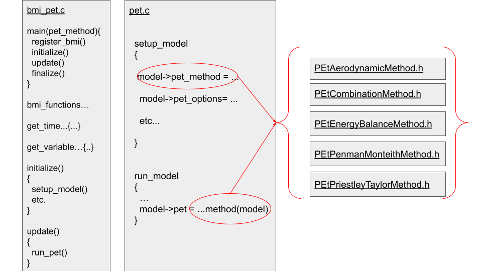

# Basic Model Interface (BMI) for potential evapotranspiration (PET) functions:
* Aerodynamic method
* Combination method
* Energy balance method
* Penman Monteith method
* Priestley Taylor method

# The configuration file (./configs/pet_config*.txt)
Many options are available when running this PET module. One option is passed into the executable, and that is the speficic PET method option, the rest are passed in through the configuration file. These include forcing data (type and location), vegetation characteristics, site latitude/longitude/elevation, turbidity roughness and options about the forcings available vs calculated and assumed. Each instance of a PET model should have its own unique configuration file. 

# Compiling this code
The BMI functionality was developed as a standalone module in C. To compile this code the developer used these steps:
1. `module load gnu/10.1.0`
2. `gcc -lm ./src/main_read_forcing.c ./src/pet.c ./src/bmi_pet.c -o run_bmi`
This should generate an executable called **run_bmi**. To run this executable you must pass the path to the corresponding configuration file, which includes the PET method you would like to run. Unit tests for those methods, and corresponding are provided, and can be run using:
1. Energy balance method: `./run_bmi pet_config_unit_test1.txt`
2. Aerodynamic method: `./run_bmi pet_config_unit_test2.txt`
3. Combination method: `./run_bmi pet_config_unit_test3.txt`
4. Priestley Taylor method: `./run_bmi pet_config_unit_test4.txt`
5. Penman Monteith method: `./run_bmi pet_config_unit_test5.txt`  
Included in this repository is an environment file (env_cheyenne.sh), and two "make and run" files. `make_and_run_read_forcings.sh` will compile the code and run the five PET methods. 
The other is `make_and_run_pass_forcings.sh`, which is an example of how the PET model will be run in a framework, where the forcing values are passed in through BMI functions (e.g., set_value()). An environment file exists, which should allow you to run compile and run the potential evaporation routines: `source env_cheyenne.sh`. Then all you need to do is run one or both of the two scrips:
1. `./make_and_run_read_forcings.sh`  
2. `./make_and_run_pass_forcings.sh`  

To build this code for use in the [Next Generation Water Resources Modeling Framework](https://github.com/NOAA-OWP/ngen), please follow the build instructions in [INSTALL.md](INSTALL.md).

# This rough code outline shows a basic outline of workflow. 
The `pet_bmi.c` file runs BMI functions that initialize, update and finalize an instance of a PET model. It also includes descriptive functions to interpret specifics of the model, such as variable names, units, time/timestep, etc. And it also allows a user (or framework) to get and set values in this model. The `bmi_pet.c` code interacts with the `pet.c` code, which sets up the model based on the PET method chosen. For instance, the aerodynamic method does not calculate the net radiation before calling the PET subroutine, but the other PET methods do. This pet.c file then calls one of the five PET methods available at this time. When a method is called it returns a value for PET in m/s, and that is set directly to the BMI model structure.

# Notes from author of the PET functions
evapotranspiration (ET) module,  
Version 1.0 by Fred L. Ogden, NOAA-NWS-OWP, May, 2020.  
includes five different methods to calculate ET, from Chow, Maidment & Mays Textbook, and UNFAO Penman-Monteith:  
1. energy balance method
2. aerodynamic method
3. combination method, which combines 1 & 2.
4. Priestley-Taylor method, which assumes the ratio between 1 & 2, and only calculates 1.
5. Penman-Monteith method, which requires a value of canopy resistance term, and does not rely on 1 or 2.
This subroutine requires a considerable amount of meteorological data as input.
   * a) temperature and (relative-humidity or specific humidity) and the heights at which they are measured.
   * b) near surface wind speed measurement and the height at which it was measured.
   * c) the ambient atmospheric temperature lapse rate
   * d) the fraction of the sky covered by clouds
   * e) (optional) the height above ground to the cloud base. If not provided, then assumed.
   * f) the day of the year (1-366) and time of day (UTC only!)
   * g) the skin temperature of the earth's surface.
   * h) the zero-plane roughness height of the atmospheric boundary layer assuming log-law behavior (from land cover)
   * i) the average root zone soil temperature, or near-surface water temperature in the case of lake evaporation.
   * j) the incoming solar (shortwave) radiation.  If not provided it is computed from d,e,f, using an updated method similar to the one presented in Bras, R.L. Hydrology.  Requires value of the Linke atmospheric turbidity factor, which varies from 2 for clear mountain air to 5 for smoggy air.  According to Hove & Manyumbu 2012, who calculated values over Zimbabwe that varied from 2.14 to 3.71.  Other values exist in the literature.  
**NOTE THE VALUE OF** evapotranspiration_params.zero_plane_displacement_height COMES FROM LAND COVER DATA.  
 Taken from:    https://websites.pmc.ucsc.edu/~jnoble/wind/extrap/  

| Roughness class  | Roughness length(m)  | Landscape Type                                                                             |  
| ---------- | ----------- | ------------------------------------------------------------------------------------------- |  
| 0         | 0.0002     | Smooth water surface                                                                       |  
| 0.2       | 0.0005     | Inlet water                                                                                |  
| 0.5       | 0.0024     | Completely open terrain, smooth surface, e.g. concrete runways in airports, mowed grass, etc.|  
| 1         | 0.03       | Open agricultural area without fences and hedgerows and very scattered buildings. Only softly rounded hills |  
| 1.5       | 0.055      | Agricultural land with some houses and 8 metre tall sheltering hedgerows with a distance of approximately 1250 metres |  
| 2         | 0.1        | Agricultural land with some houses and 8 metre tall sheltering hedgerows with a distance of approximately 500 metres |  
| 2.5       | 0.2        | Agricultural land with many houses, shrubs and plants, or 8 metre tall sheltering hedgerows with a distance of approximately 250 metres |  
| 3         | 0.4        | Villages, small towns, agricultural land with many or tall sheltering hedgerows, forests and very rough and uneven terrain |  
| 3.5       | 0.8        | Larger cities with tall buildings|  
| 4         | 1.6        | Very large cities with tall buildings and skyscrapers|  

Roughness definitions according to the European Wind Atlas.  
According to the UN FAO Penman-Monteith example [here](http://www.fao.org/3/X0490E/x0490e06.htm#aerodynamic%20resistance%20)  
The zero plane roughness length,"d" can be approximated as 2/3 of the vegetation height (H): d=2/3*H for grassland/cropland or selected from above table based on comprehensive land cover categories.  
The momentum roughness height "zom" can be estimated as 0.123*H (or 0.1845*d when d is selected from above table).  
The heat transfer roughness height "zoh" can be approximated as 0.1*zom.  

# A note on code adaptation for BMI
This code was minimally changed from the author's original version. These minor changes were made by Nextgen NWM formulation team:
* Much of this C code was moved to `*.h` files, with the intention of being more easily integrated into the Nextgen Framework. It turned out that this step was not strictly necessary, and that this standalone module could use the standard `*.c` files. See known issues below for a discussion on turning these back to `*.c` files.
* At one point the C code was slightly modified to compile as C++ code. This was intended for easier integration with the Nextgen Framework. This was reversed when developed as a standalone module.
* Functions that are neccessary for PET calculations, but are not part of an individual method (e.g., `calculate_solar_radiation`), were moved to this file: `./include/pet_tools.h`
* The PET code was split up so that the functions were in standalone files, and they could be called independently. An example: `EtPenmanMonteithMethod.h`
* Variables within the PET functions (e.g., `psychrometric_constant_Pa_per_C`) are passed as part of the model structure (e.g., `model->inter_vars.psychrometric_constant_Pa_per_C`)

# Code issues as of May 5th 2021
* Much of this code was moved from a single original `*.c` file to several `*.h` files, for easier integration into the Nextgen Framework. This is likely not the best practice, and should probably be reversed, so that functional code is stored in `*.c` files and declarations are stored in `*.h` files.
